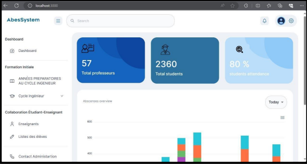
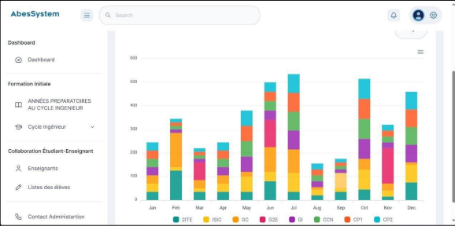
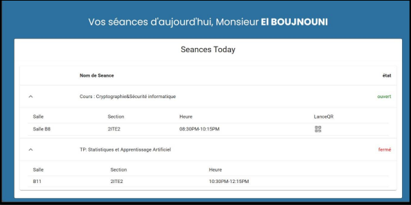
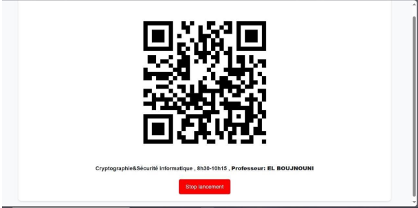
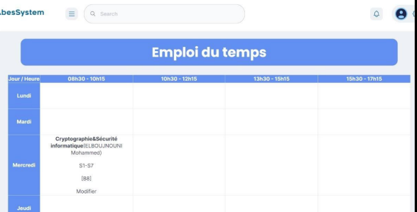
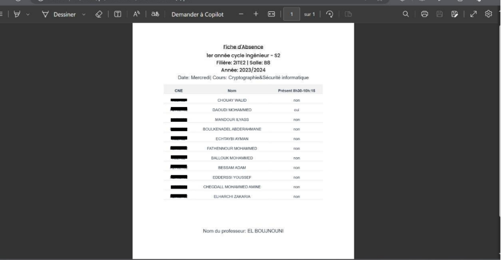
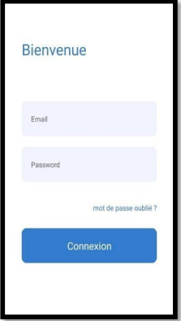
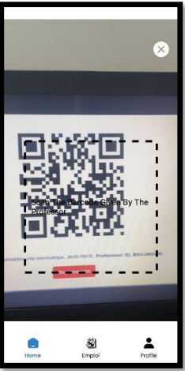
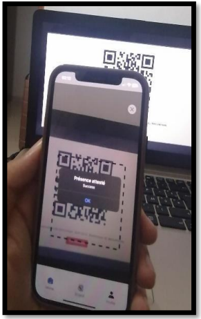

# ENSAJ Attendance Management System 📚

<div align="center">


[](https://www.mongodb.com/mern-stack)
[](LICENSE)
[](VERSION)

</div>

## 🌟 Overview

A modern, QR code-based attendance management system built for ENSAJ (École Nationale des Sciences Appliquées d'El Jadida). This system streamlines the attendance tracking process through an intuitive web interface for administrators and professors, complemented by a mobile application for students.


## ✨ Key Features

### For Administrators 👨‍💼
- Comprehensive dashboard with real-time statistics
- User management (students, professors)
- Course and schedule management
- Access to attendance reports and analytics
- Department and class management

### For Professors 👨‍🏫
- QR code generation for class sessions
- Real-time attendance tracking
- Course schedule viewing
- Student attendance history
- Export attendance reports

### For Students 📱
- Mobile app for QR code scanning
- View personal attendance records
- Check class schedules
- Real-time attendance confirmation

## 🛠️ Technology Stack

<div align="center">

| Technology | Purpose |
|------------|---------|
|  | Database |
|  | Backend Framework |
|  | Frontend Web |
|  | Runtime Environment |
|  | Mobile App |

</div>


## 🚀 Getting Started

### Prerequisites

- Node.js (v14 or higher)
- MongoDB
- npm or yarn
- React Native environment setup (for mobile development)

### Installation

1. **Clone the repository**
```bash
git clone https://github.com/Mohammedaoudi/abes-qr-attendance.git
cd abes-qr-attendance
```

2. **Set up environment variables**

Create `.env` files in both backend and frontend directories:

Backend `.env`:
```env
PORT=5000
MONGODB_URI=your_mongodb_uri
JWT_SECRET=your_jwt_secret
```

Frontend `.env`:
```env
REACT_APP_API_URL=http://localhost:5000
```

3. **Install dependencies and start the servers**

```bash
# Backend setup
cd backend
npm install
npm start

# Web setup
cd web
npm install
npm start

# Mobile setup
cd mobile
npm install
npx react-native run-android  # or run-ios
```

## 🖥️ Web Application Screenshots

### Admin Dashboard
<div align="center">
<table>
  <tr>
    <td></td>
    <td></td>
  </tr>
</table>
</div>

### Professor Interface
<div align="center">
<table>
  <tr>
    <td></td>
    <td></td>
  </tr>
</table>
</div>

### Schedule and Attendance
<div align="center">
<table>
  <tr>
    <td></td>
    <td></td>
  </tr>
</table>
</div>

## 📱 Mobile Application Screenshots

<div align="center">
<table>
  <tr>
    <td></td>
    <td></td>
    <td></td>
    <td></td>
  </tr>
</table>
</div>

## 🎥 Demo Video

<div align="center">


 https://github.com/user-attachments/assets/b5efc9fd-d663-4a65-ac53-817d42299a63
 


</div>

## 👥 Contributors

- [DAOUDI Mohammed](https://github.com/Mohammedaoudi)
- [CHOUAY Walid](https://github.com/CHOUAY15) 
- [BESSAM Adam](https://github.com/AdamBessam)

## 📄 License

This project is part of an academic project at ENSAJ (2023-2024) and is licensed under the terms of academic usage.

## 🙏 Acknowledgments

Special thanks to:
- Prof. EL BOUJNOUNI Mohamed for project supervision
- ENSAJ administration for their support
- All testers and early adopters

---

<div align="center">

Made with ❤️ by Team 2ITE | ENSAJ 2023-2024

[Report Bug](https://github.com/Mohammedaoudi/abes-qr-attendance/issues) · [Request Feature](https://github.com/Mohammedaoudi/abes-qr-attendance/issues)

</div>